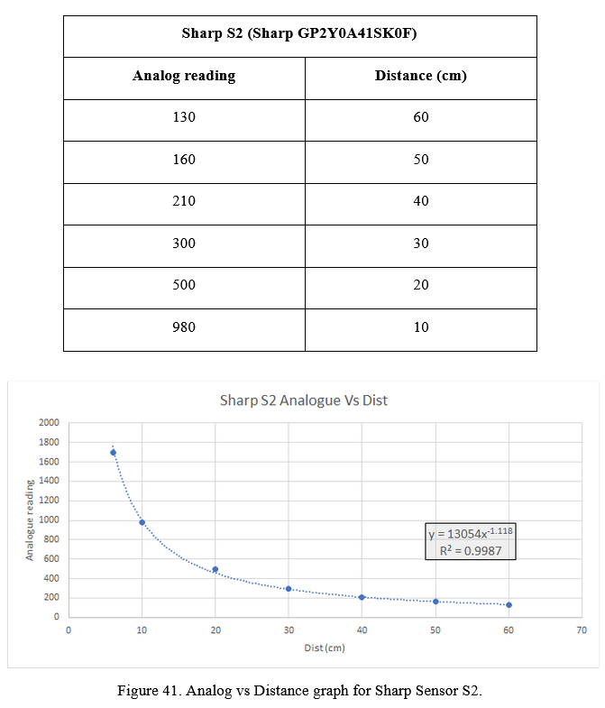

Context
---

This project was done in groups of 9-10 people, with each group separated into 3 sub-teams; Electrical, Mechanical and Programming. I volunteered to be in the programming team to challenge my programming skills. Each group is to work together to create an autonomous ball collecting and dispensing robot. The details of how the robots are to be judged are detailed below.

Two robots will be put against each other as per the above figure. Both robots compete against each other to pick up and deliver as many tennis balls as possible within a time limit of 3 minutes. The robot that picks up the greater number of balls within the round is considered the victor.

**Some details of the competition include:**
  
- Three balls will be placed randomly across the arena (but not too close to the edges or to each other, after the halfway point of the arena).
- The arena is bounded by a yellow reflecting tape as the boundary, surrounded by a 30mm high slope.
- Each robot can only carry one ball at once. If the robot takes more than one ball, it must release the extra balls immediately.
- The robot is not allowed to throw or roll the balls back towards the collection area. It needs to carry it back to the delivery area after collection. 
- The delivery area has a wall directly in front, and the ball must be lifted over the wall to be delivered.

---
Rules & Requirements
---

- Dimensions of the robot must be under 30cm x 30cm x 30cm. 
- The robot is prohibited from expanding its size once the event has begun.
- The robot must comprise of more than 50% components provided by the laboratory.
- The robot’s power supply is restricted to a 6-cell AA rechargeable battery pack given.
- The robot should have excellent manoeuvrability, which includes factors such as optimal wheel shape and a well-balanced driving wheel or steering system.
- High-resolution sensors can be utilised to efficiently locate the balls.
- Sensors will be placed at the periphery of the robot to enable it to detect the limits of the arena.
- The robot must differentiate between a ball and an opponent robot.
- Retrieval device must be present to grasp the ball and enable the robot to return to the delivery area for ball delivery.
- The robot must be able to identify the collection zone and dispense the ball upon reaching the collection zone.
- The robot will then return to the arena in order to find additional balls.
- Use of extra sensors, servos, motors, or batteries beyond what is given is prohibited.
- There is no limit to the number of limit switches that can be mounted on the robot.

---
Sensor Preparation
---

As part of the programming team, we need to work with the sensors a lot. Besides giving input on sensor placement, we also had to prepare each individual sensor as they might vary slightly between each other even if they are the same model - kind of in the same way as in silicon lottery. Some are better than the others.

**Sensors:**
1. Sharp GP2Y0A21YK0F Analog Distance Sensor x4
2. TCRT5000 Infrared Reflective Sensor x2

<h3>Sharp GP2Y0A21YK0F Analog Distance Sensor:</h3>

- This sensor had the most variation between each individual sensor. This meant that we had to test each one individually at multiple distances.

- We measured the analogue reading coming from the sensor at multiple distances. Using those data points, we were able to plot a graph of the behaviour of each individual sensor.

- From the data, we can see that analogue reading vs distance follows an inverse power relationship. 

<h3>TCRT5000 Infrared Reflective Sensor:</h3>

- There is nothing much to comment on this sensor. This sensor is used to detect the yellow lines of the periphery of the arena. All sensors had similar outputs and the threshold to detect a change between the main arena and the periphery was stark enough that no additional preparation was required for us to use these sensors.

After gathering the behaviour of all sensors, we were in a better position to program the distances for our robot to turn or travel.

---
Sensor Placement
---

- This is a CAD drawing of our assembled robot done by the Mechanical team. Our robot uses a scoop to collect the ball onto its ramp. When collected, it would use the compass to align itself to the dispensing area at the back of the arena and reverse until the limit switches hit the dispensing area. Once the limit switches have been hit, it will release the ball by rotating the scoop further. 

- This diagram shows the locations where sensors have been placed.

Our team completed the mechanical design for the robot before actually really diving deep into the programming aspect of the project. In hindsight, this was a really bad move by us as we found out later that our sensor placement introduced some programming challenges that would be easier to fix with better sensor placement. We were however, in too deep by that point and had to work with what we had.

---
Robot Logic Programming
---

This was easily the toughest part of the project and took us the longest amount of time to get right. Many days were spent in the mechatronics lab testing various parameters or coding logic.

We had a few challenges to solve.

<h3>Turning angle:</h3>

Initially, our logic made the robot turn a fixed amount whenever it detects a ball in order to align the ball to the robot's center. We quickly found out that this was a problem because the amount to turn cannot be a fixed amount because the ball's distance to the robot is not a fixed amount. The closer the ball is to the robot, the more it has to turn in order to align itself to the ball. This is illustrated in the diagram drawn below.

We dealt with this by taking in the analogue reading from the distance sensor, linearised it, and used it to determine the amount to turn the robot based on the distance of the ball. This solved our consistency issues and made our robot much more reliable.

<h3>Hard-Coded Logic:</h3>

Our initial logic was coded simply. If the ball was detected by the right sensor, our robot will pan right to align itself to the ball, and vice versa.

- We soon realised that while the above logic works in an ideal situation, our situation was not very ideal as the robot will slip when attempting to stop, which causes the sensor to overshoot the ball by a small amount - enough to throw off realignment to the ball. 

This meant that we had to work in a way to detect overshoot and for our robot to autonomously self-correct its alignment when it occurs.

<h3>Overshoot Correction:</h3>

When no overshoot occurs, the direction that the robot was panning while searching for the ball does not matter. However, when overshoot occurs, it is absolutely vital for the robot to know what direction it was panning in as this would determine if the overshoot is in the left or right direction. This is shown in the diagram below.

- How the robot should behave differs greatly based on the last panning direction and sensor detection.

After accounting for all these unique situations in our programming, our robot became much more reliable in collecting the ball.

---
Conclusion
---

Building a robot is hard, but programming a robot is even harder.

This was a great experience as we were forced to use simple sensors to design something autonomous. This really challenged our way of thinking and programming and gave me a newfound respect for all innovators in the robotics sector out there.

