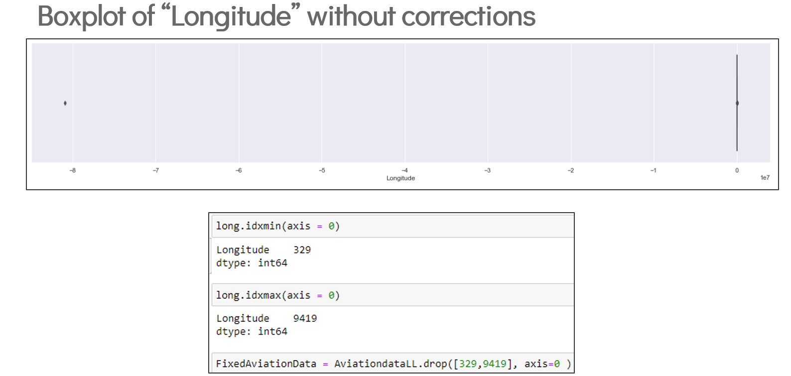
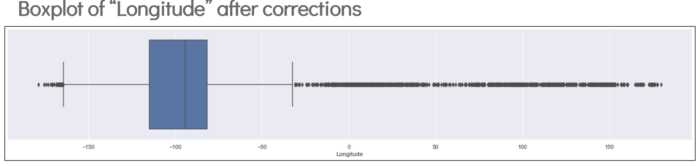
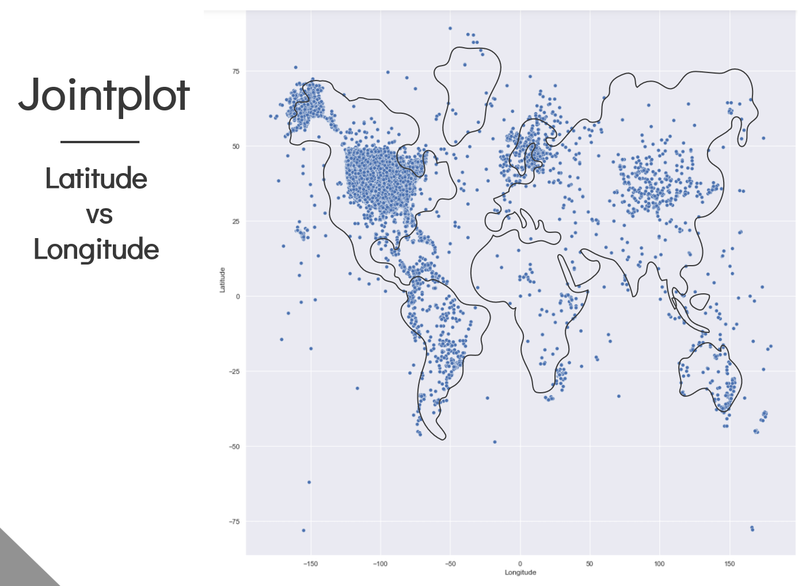
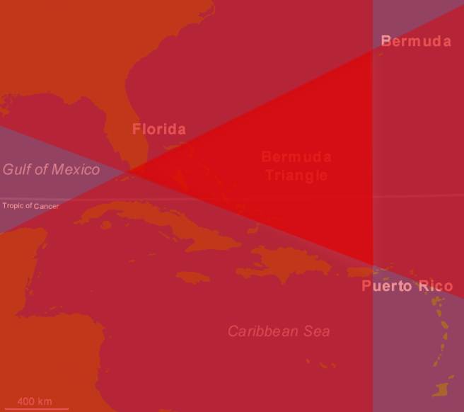
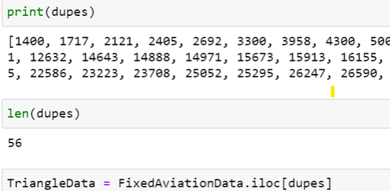
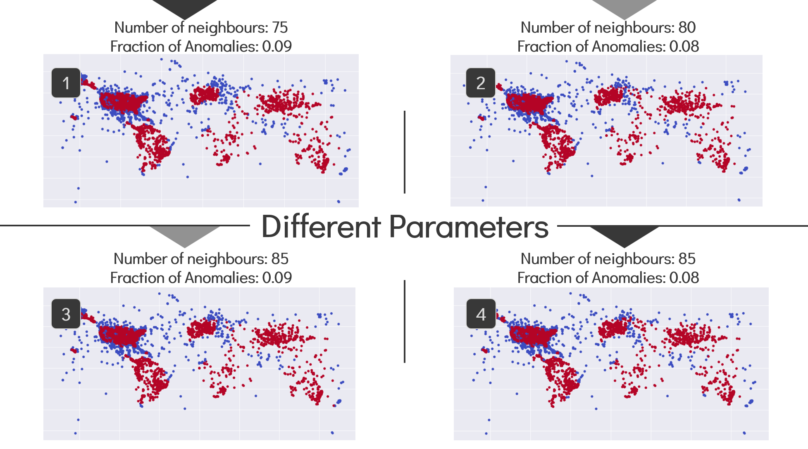
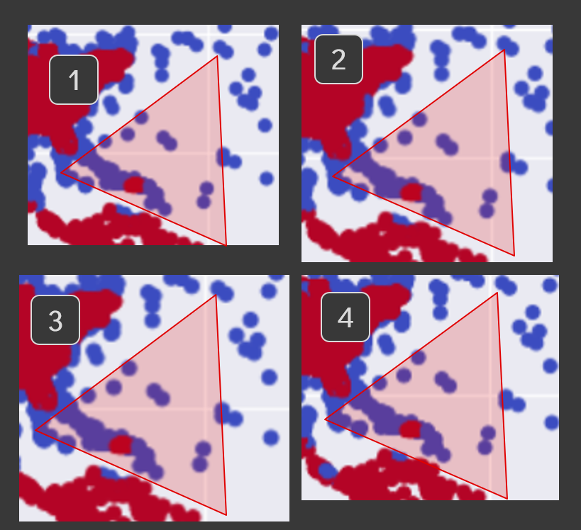

Context
---

For this project, we were given a data set of 85,977 global aviation accidents data points collected over 50 years which consisted of data such as longitude and latitude data, type of accident, type of aircraft, etc.

After much thought, we realised that we might be able to debunk the mystery of the Bermuda triangle where aircraft and ships tend to disappear under mysterious circumstances. 

Of course before starting on data analysis, data clean up is always required to remove erroneous points. We used boxplot and simple code to visually inspect the erroneous points and remove them from the data set.

---
Data Preparation and Clean-up
---

<h3>Before removal of erroneous data points:</h3>

- Box plot looks completely wrong due to impossible extreme outliers.

<h3>After removal of erroneous data points:</h3>

- A more normal-looking box plot after removal of erroneous points. This indicates that all erroneous points have been removed.

<h3>Joint plot Map:</h3>

- With the erroneous points gone, a joint plot of longitude and latitude results in something that resembles the world map. This makes sense because we expect more accidents to occur near land as the majority of aviation accidents occur during take-off and landing.

- The points do not fit exactly on the world map because of the map projection distortion when projecting from a 3D sphere to a 2D image.

---
Novel Filtering of Points Within a Triangle
---

Now that we have a joint plot map of aviation accidents, we have to filter the data that are found within the Bermuda triangle. This was where we hit a snag. There was no built in function to filter out data points in a triangular shape. 

We spent a few days thinking about ways to achieve this and it was only after an epiphany that I realised secondary school maths could finally come into good use. y = mx + c. Using this formula and the longitude and latitude of each corner of the Bermuda triangle, we were able to determine if a point was able or below a side of the triangle, one data frame for each side of the triangle, repeat this 3 times and by finding duplicates between all 3 data frames, it will give us a data frame with only the points found within the triangle. 

- Here is a visual representation of that messy train of thought. The darkest part has the most overlaps and hence represents the area with 3 duplicate points.

Lo and behold,

**It worked!**

Out of 85,977 accidents, we have identified **56** points that fall within the Bermuda triangle.

Things weren't looking good for this myth.

---
Conclusion
---

The main idea of this was to use the filtered data points from within the Bermuda triangle to see if anything stands out statistically.

To cut the long story short, it was pretty normal.

We ran a bunch of comparisons and ultimately came up with nothing. There is nothing that shows that there is a higher incidence rate of anything within the Bermuda triangle.

The other comparisons were pretty lacklustre so I'll just share the most visually appealing comparison we made.

<h3>Anomaly Detection Example:</h3>

- Anomaly detection shows points which are very close together in high amounts. In layman terms, if the Bermuda triangle was truly a place where a lot of aviation incidents occur, it should be the only portion of the map that will show up in a red colour. The fact that all those other land masses show up as red before the Bermuda triangle does indicates that this myth is busted.

The highlight of this project was figuring out how to filter out the data within a triangular shape. It was a novel method that will probably not have any other uses besides for this. The fact that I came up with this solution before the advent of LLMs is a surprise to myself even to this day.