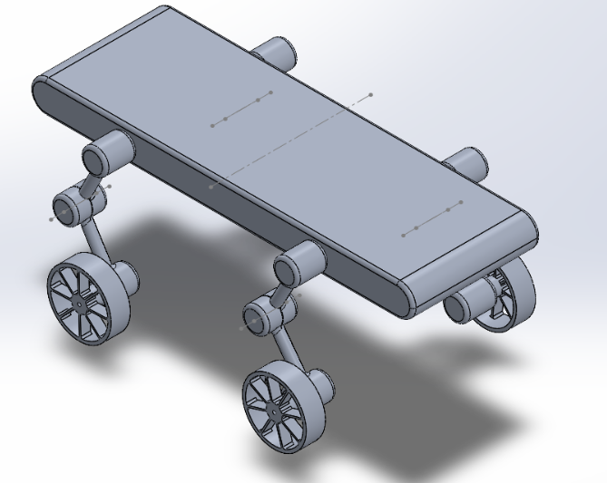
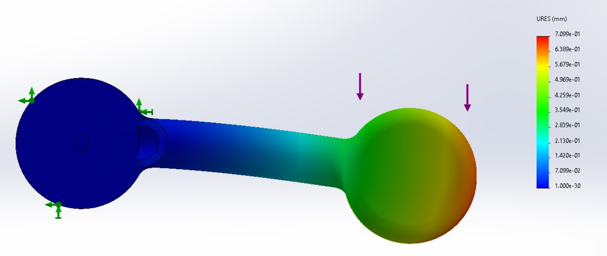
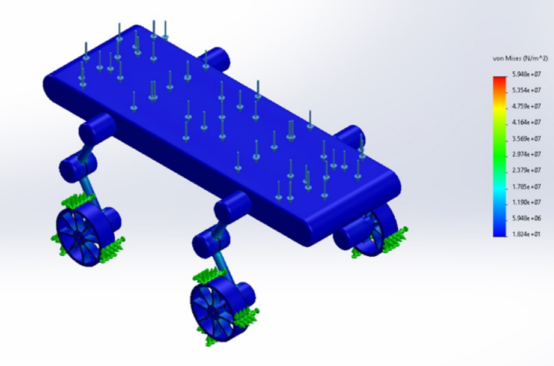
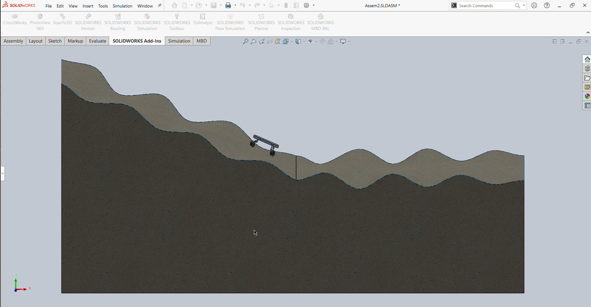
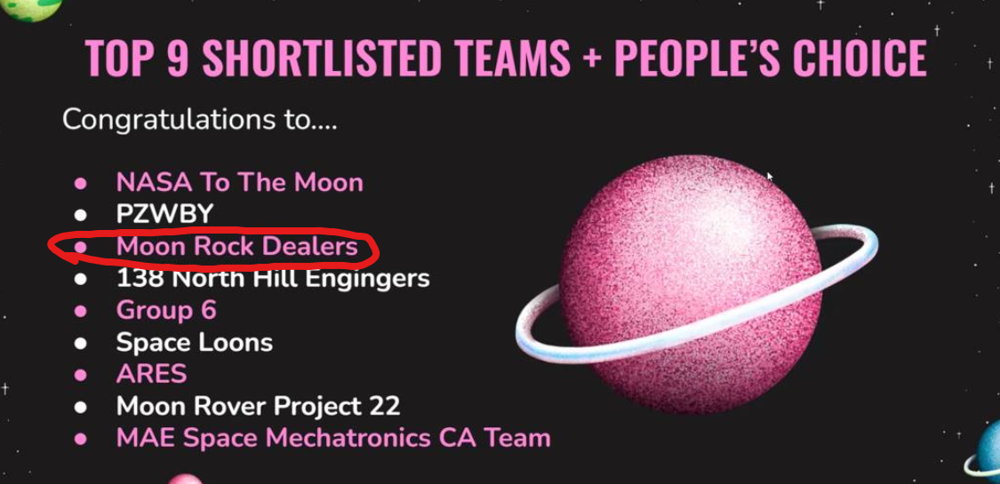

Context
---

This project was entered into the [NTU Lunar Exploration Innovation Challenge 2022](https://www.ntu.edu.sg/admissions/undergraduate/premier-scholar-programmes/renaissance-engineering-programme/achievements/year-2022/lunar-exploration-innovation-challenge-2022).

**About the competition:** "*Participating teams were judged on their ideas for innovative pace technology that will help improve lunar exploration, such as rover designs, communications, software and suspension systems. The competition was judged by esteemed NASA astronaut Jeff Williams, who spent the second highest amount of time in space in the world. The challenge was organised by NTU’s School of Mechanical and Aerospace Engineering Robotics Club, in conjunction with Aspire Incubation Lab.*"

<h3>Our Entry, The MoonDog:</h3>

- This was our entry under our team name "**Moon Rock Dealers**".

The concept behind MoonDog is that since unmanned lunar rovers operate without direct human intervention, they can become immobilized if their wheels fail to free them from a tough spot. To overcome this, the MoonDog is designed with limbs that can activate and "walk" the rover out of such situations.

---
Stress Simulations and Analysis
---
Solidworks has a suite of tools that allow for stress analysis. 

- Example of a single part stress analysis. This being one of the limbs of the MoonDog.

- Full assembly stress analysis was done to determine the weight it could hold. This was a concern to us due to the limbs where we thought might be a weak point.

---
Movement and Motion Analysis
---

- Simulating the MoonDog traversing on a wavy lunar surface terrain.

---
Conclusion
---
We entered into this competition expecting nothing of it.

**Surprise!**

***We were shortlisted.***

It was definitely a nice surprise to see our work recognised. Shortlisted teams were given the option to be funded to create a prototype of their design to present to NASA astronaut, [Jeffrey Williams](https://en.wikipedia.org/wiki/Jeffrey_Williams_(astronaut)). Unfortunately, due to the other commitments of everyone in our team, we did not have the capacity to accept the funding and create the prototype. 

However, despite not building the prototype, the experience was incredibly rewarding. The opportunity to have our design recognized at such a level reaffirmed the effort we put into the project. It was inspiring to see other teams bring their ideas to life, and it left us with a sense of accomplishment and motivation for future endeavours. While we couldn't take this opportunity further, the knowledge and experience gained will shape our approach to future projects.
