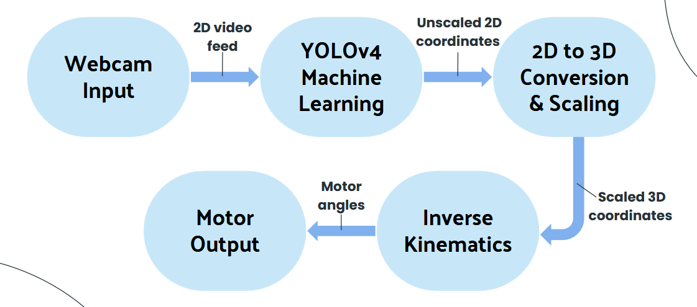
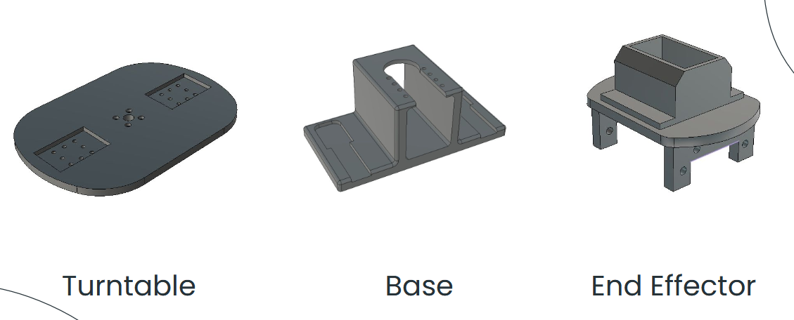
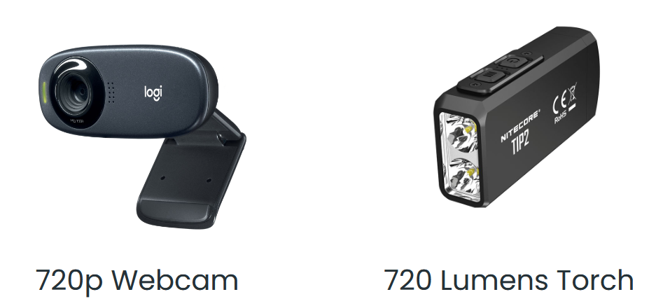
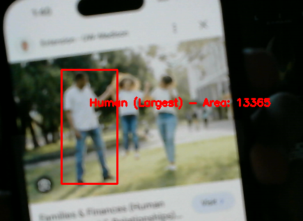
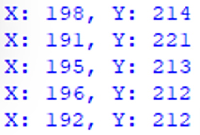
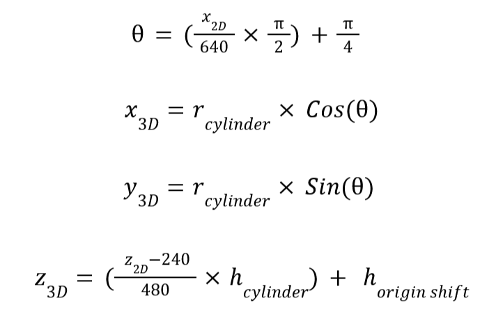
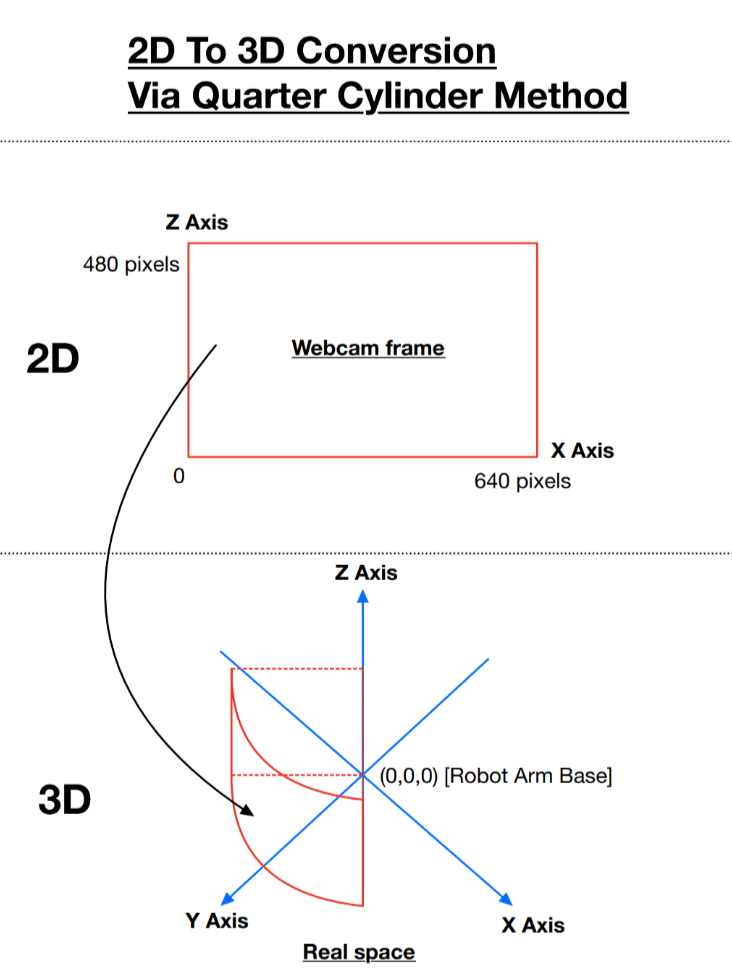
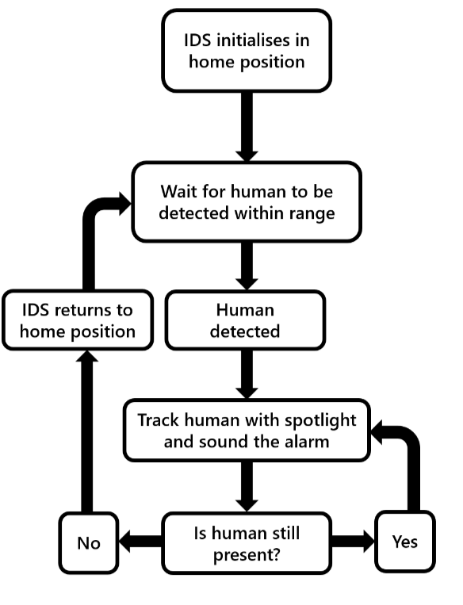
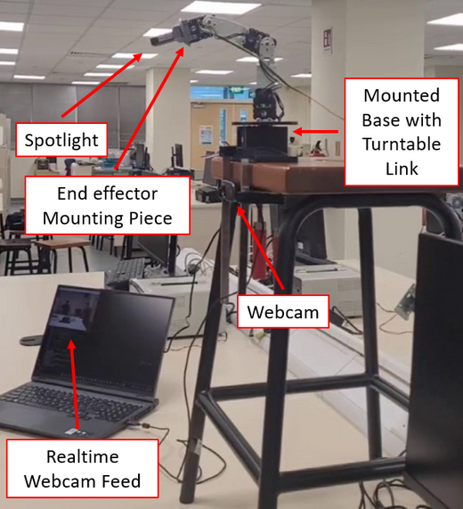

Context
---

This project was for a robotics module where we were given a certain number of motors and had free reign to design a robot arm for any application. After much back and forth between the members, we decided that we wanted something that no other group could have done before. After too many weeks of ideation, we finally came up with the idea to do an intruder detection spotlight arm that would use machine learning and a camera to identify humans, and track them with a spotlight in real time. Kind of like in old cartoon skits where a prisoner is shone in a moving spotlight that tracks them.

The idea actually evolved from initially wanting to use an Xbox 360 Kinect to a webcam. We wanted to use the 3D radar mapping capabilities of the Kinect 360 to make coordinate transformation easier but after I tested the Kinect for 2-3 weeks, we determined that there is not enough support for the Kinect 360 to integrate well with the newer version of Python we were running. It was a tough but necessary decision for the project to move forward.

My responsibilities in the team was mainly for setting up and connecting a machine learning model with python and computer vision. This meant that I needed to convert the coordinate data from the webcam and turn it into usable information for inverse kinematics to work. 

<h3>Data Processing Flowchart:</h3>

- The first 3 bubbles were my key responsibilities.

---
Equipment
---

The following were the additional things we had to use to make this project a reality.

- These models were done and 3D-printed by my wonderful group mates.

- A webcam.
- A small but high intensity torchlight.

---
Computer Vision & Machine Learning Implementation
---
There's not much to say here to be honest, OpenCV library was used to enable Python to access the webcam and there were many pre-trained machine learning model on the internet. I just chose a few that were fast enough to enable relatively smooth tracking on laptop hardware. YoloV4 was the final model that had a good mix of performance and accuracy of detection. 

Most of the exciting things that happened during this stage occurred when I was experimenting with the Kinect 360 but those memories are better left untouched :')

- What the YoloV4 model detects. I coded it such that if it detects multiple humans in frame, it will calculate the amount of area that the human takes up in frame and chooses the human that gives the largest area.

- The dynamic output after detecting the largest human and calculating the coordinates in terms of pixels.
---
2D to 3D Coordinate Conversion
---
This was something we paid no attention to during the early stages of the project. "It's going to be simple", we thought. Oh, how wrong we were. 

This stage of the project was easily the largest hurdle for us and took the longest amount of time to troubleshoot and get right. In fact, we literally only got it working 100% the day before the showcase of our project. The main problem was that we did not understand what was the exact cause of the many issues we have experienced. Additionally, due to the dynamic nature of the project, the issues manifest themselves in different ways based on the different methods we try. This made it really hard to pinpoint and identify the exact problem.

Listed in the table below are all the methods we have tried.

| **Method** | **Issues** |
| :--------------------------- | -------------------------------------------------------------: |
| **Converted 2D coordinates into a flat 3D plane in front of the robot arm.** | The robot arm could move, but due to geometry misalignment, it did not point at the correct location where the human was standing. |
| **Converted the 2D coordinates into a half-sphere in front of the robot arm.** | The program ceased to function because the webcam's axis range exceeded the sphere's radius, causing a math error. |
| **Formulated a double parabola equation to map 2D coordinates into a 3D curved surface in front of the robot arm.** | Introduced a new issue where scaling the 2D coordinates resulted in inaccurate pointing at the target’s location. |
| **Formulated an equation to map 2D coordinates into a half-cylinder in front of the robot.** | Made the robot arm turn excessively to the left and right. |
| **Formulated an equation to map 2D coordinates into a quarter-cylinder in front of the robot.** | No issues. Provided the most accurate tracking result and allowed easy incorporation of scaling directly into the equations. |

In hindsight, the solution was so simple all along. I only had the eureka moment 2 days before our showcase of the project where I finally understood why the problems had been occurring. The problem was, we were initially mapping 2D to 3D coordinates haphazardly without giving a thought to the actual range of motion of our physical robot arm. This was the cause of our downfall. 

Once I understood the problem, I then created some formulas to convert 2D coordinates into 3D coordinates in a quarter cylinder shape, which better represented the range of motion of our robot arm.

- I know it does not mean much to anyone, but here are the project-saving formulas. I was and still am very proud of them.

- With this, the robot started working without math errors, crashes, and a multitude of other issues.

---
Conclusion
---
In conclusion, don't underestimate how tough some things might be even if they seem simple at first. Or else you might have to pay by staying back in school until 9pm for 3 days straight like we did trying to rectify one issue.

Also, here are some other details and photos about the project you might find interesting.

<h3>Logic Flowchart:</h3>

<h3>Complete Setup:</h3>

<h3>Our Spotlight Arm Tracking Someone:</h3>

